# AGI-Inspired Capabilities for Beddel

> **Document Purpose**: This document outlines insights and architectural recommendations for implementing AGI-like capabilities in Beddel, based on a minimal multi-runtime architecture and model server pattern.

---

## Executive Summary

A minimal AGI-style architecture combines a multi-runtime orchestrator with a model server. This document translates that architecture into actionable patterns for Beddel's TypeScript-based agent framework.

---

## Core Architecture

### The Orchestrator Pattern

The central component is a command loop that continuously coordinates specialized modules:

```mermaid
graph TB
    subgraph Orchestrator["🎯 Orchestrator (Central Command Loop)"]
        CMD[Command Loop]
    end
    
    subgraph Cognitive["🧠 Cognitive Modules"]
        PLAN[Planning]
        REASON[Reasoning]
        META[Metacognition]
        CREAT[Creativity]
    end
    
    subgraph Action["⚡ Action Modules"]
        ACT[Actions]
        AUTO[Autonomy]
        SIM[Simulation]
    end
    
    subgraph Knowledge["📚 Knowledge Modules"]
        KNOW[Knowledge]
        MEM[Memory]
        LEARN[Learning]
        WORLD[World Model]
    end
    
    subgraph Interface["🔌 Interface Modules"]
        NLP[NLP]
        LANG[LangModel]
        UPGRADE[Self-Upgrade]
    end
    
    CMD --> Cognitive
    CMD --> Action
    CMD --> Knowledge
    CMD --> Interface
    
    PLAN --> REASON
    REASON --> ACT
    ACT --> MEM
    MEM --> LEARN
    LEARN --> KNOW
    META --> UPGRADE
```



### Key Runtime Loops

| Loop | Description | Beddel Equivalent |
|------|-------------|-------------------|
| **Orchestrator Command Loop** | Main loop reading commands and dispatching to modules | Agent workflow orchestration |
| **Autonomy Loop** | Periodic decision cycles with module broker | Multi-agent coordination |
| **Plan → Reason → Act** | Strategic and tactical planning execution | Agent action pipeline |
| **Experience → Knowledge → Learning** | Continuous learning from interactions | RAG + memory persistence |
| **World Model & Simulation** | External state modeling and scenario testing | Knowledge source integration |
| **Metacognition & Self-Upgrade** | Self-observation and improvement | Agent performance monitoring |

---

## Beddel Agent Implementations

### 1. Planning Agent

**Capability**: Long-term + short-term planners

**Beddel Implementation**:

```yaml
# agents/planning-agent.yaml
name: planning-agent
description: Strategic and tactical planning agent
model:
  provider: gemini
  name: gemini-2.0-flash
system_prompt: |
  You are a strategic planning agent. Your role is to:
  1. Create long-term plans with clear milestones
  2. Break down goals into actionable short-term tasks
  3. Maintain plan dependencies and priorities
  4. Adapt plans based on feedback and outcomes
  
  Always respond with structured JSON containing:
  - goal: refined objective
  - steps: ordered list of actions with dependencies
  - priority: 1-10 scale
  - confidence: 0.0-1.0 probability of success
implementation: planning-agent.ts
```

```typescript
// agents/planning-agent.ts
import { AgentProps, AgentResult, AgentContext } from "beddel";

interface Plan {
  id: string;
  type: "long-term" | "short-term";
  goal: string;
  steps: PlanStep[];
  priority: number;
  confidence: number;
  createdAt: Date;
}

interface PlanStep {
  order: number;
  action: string;
  dependencies: string[];
  estimatedDuration: string;
  status: "pending" | "in-progress" | "completed" | "failed";
}

export async function execute(
  props: AgentProps,
  context: AgentContext
): Promise<AgentResult> {
  const { action, goal, planId, feedback } = props.input;

  switch (action) {
    case "create-long-term":
      return await createLongTermPlan(goal, context);
    case "create-short-term":
      return await createShortTermPlan(planId, goal, context);
    case "refine":
      return await refinePlan(planId, feedback, context);
    case "status":
      return await getPlanStatus(planId, context);
    default:
      return { error: `Unknown action: ${action}` };
  }
}

async function createLongTermPlan(
  goal: string,
  context: AgentContext
): Promise<AgentResult> {
  const plan: Plan = {
    id: crypto.randomUUID(),
    type: "long-term",
    goal,
    steps: [],
    priority: 5,
    confidence: 0.8,
    createdAt: new Date(),
  };

  // Use LLM to generate steps
  const response = await context.llm.generate({
    prompt: `Create a detailed long-term plan for: ${goal}`,
    responseFormat: "json",
  });

  plan.steps = JSON.parse(response).steps;
  
  // Persist plan to memory
  await context.memory.set(`plan:${plan.id}`, plan);

  return { success: true, data: plan };
}
```

---

### 2. Reasoning Agent

**Capability**: Multi-domain inference engine

**Beddel Implementation**:

```yaml
# agents/reasoning-agent.yaml
name: reasoning-agent
description: Multi-domain reasoning and inference agent
model:
  provider: gemini
  name: gemini-2.0-flash
system_prompt: |
  You are a reasoning engine that:
  1. Collects signals from multiple sources/domains
  2. Generates hypotheses based on evidence
  3. Produces verdicts with confidence scores
  4. Provides actionable directives
  
  Use chain-of-thought reasoning. Always cite supporting evidence.
implementation: reasoning-agent.ts
```

```typescript
// agents/reasoning-agent.ts
import { AgentProps, AgentResult, AgentContext } from "beddel";

interface SignalPacket {
  source: string;
  domain: string;
  data: Record<string, unknown>;
  timestamp: Date;
  confidence: number;
}

interface Verdict {
  hypothesis: string;
  confidence: number;
  directives: string[];
  reasoning: string;
  supportingSignals: string[];
}

const signalBuffer: SignalPacket[] = [];

export async function execute(
  props: AgentProps,
  context: AgentContext
): Promise<AgentResult> {
  const { action, signal, query, domains } = props.input;

  switch (action) {
    case "collect":
      return collectSignal(signal);
    case "reason":
      return await reason(query, context);
    case "multi-domain":
      return await multiDomainAnalysis(domains, query, context);
    default:
      return { error: `Unknown action: ${action}` };
  }
}

function collectSignal(signal: SignalPacket): AgentResult {
  signalBuffer.push({ ...signal, timestamp: new Date() });
  
  // Keep only last 100 signals
  if (signalBuffer.length > 100) {
    signalBuffer.shift();
  }

  return { success: true, bufferedSignals: signalBuffer.length };
}

async function reason(
  query: string,
  context: AgentContext
): Promise<AgentResult> {
  const relevantSignals = signalBuffer.filter((s) => s.confidence > 0.5);

  const response = await context.llm.generate({
    prompt: `
      Analyze the following signals and answer: ${query}
      
      Signals: ${JSON.stringify(relevantSignals)}
      
      Provide a verdict with hypothesis, confidence, directives, and reasoning.
    `,
    responseFormat: "json",
  });

  const verdict: Verdict = JSON.parse(response);
  return { success: true, data: verdict };
}
```

---

### 3. Knowledge Agent

**Capability**: Artifact storage, search, and knowledge sync

**Beddel Implementation**:

```yaml
# agents/knowledge-agent.yaml
name: knowledge-agent
description: Knowledge management with semantic search
model:
  provider: gemini
  name: gemini-2.0-flash
system_prompt: |
  You are a knowledge management agent that:
  1. Ingests and structures information from various sources
  2. Performs semantic search across the knowledge base
  3. Extracts insights from experiences
  4. Maintains knowledge freshness and relevance
implementation: knowledge-agent.ts
```

```typescript
// agents/knowledge-agent.ts
import { AgentProps, AgentResult, AgentContext } from "beddel";

interface KnowledgeRecord {
  id: string;
  content: string;
  embedding?: number[];
  source: string;
  domain: string;
  createdAt: Date;
  metadata: Record<string, unknown>;
}

export async function execute(
  props: AgentProps,
  context: AgentContext
): Promise<AgentResult> {
  const { action, content, source, domain, query, limit, experience } = props.input;

  switch (action) {
    case "ingest":
      return await ingestKnowledge(content, source, domain, context);
    case "search":
      return await searchKnowledge(query, limit || 5, context);
    case "ingest-experience":
      return await ingestFromExperience(experience, context);
    case "sync":
      return await syncKnowledge(context);
    default:
      return { error: `Unknown action: ${action}` };
  }
}

async function ingestKnowledge(
  content: string,
  source: string,
  domain: string,
  context: AgentContext
): Promise<AgentResult> {
  const record: KnowledgeRecord = {
    id: crypto.randomUUID(),
    content,
    source,
    domain,
    createdAt: new Date(),
    metadata: {},
  };

  // Generate embedding for semantic search
  record.embedding = await context.embeddings.generate(content);

  // Store in vector database or memory
  await context.memory.set(`knowledge:${record.id}`, record);

  return { success: true, data: record };
}

async function searchKnowledge(
  query: string,
  limit: number,
  context: AgentContext
): Promise<AgentResult> {
  // Semantic search using embeddings
  const queryEmbedding = await context.embeddings.generate(query);
  const results = await context.memory.semanticSearch(queryEmbedding, limit);

  return { success: true, data: results };
}

async function ingestFromExperience(
  experience: Record<string, unknown>,
  context: AgentContext
): Promise<AgentResult> {
  // Extract structured knowledge from experience
  const response = await context.llm.generate({
    prompt: `
      Extract structured knowledge from this experience:
      ${JSON.stringify(experience)}
      
      Return: { "insights": [...], "facts": [...], "patterns": [...] }
    `,
    responseFormat: "json",
  });

  const extracted = JSON.parse(response);
  
  // Ingest each insight
  for (const insight of extracted.insights || []) {
    await ingestKnowledge(insight, "experience", "derived", context);
  }

  return { success: true, extracted };
}
```

---

### 4. Metacognition Agent

**Capability**: Self-observation, reflection, and improvement

**Beddel Implementation**:

```yaml
# agents/metacognition-agent.yaml
name: metacognition-agent
description: Self-observation and performance analysis agent
model:
  provider: gemini
  name: gemini-2.0-flash
system_prompt: |
  You are a metacognition agent that:
  1. Observes system performance metrics
  2. Reflects on past actions and outcomes
  3. Identifies patterns and areas for improvement
  4. Generates actionable self-improvement recommendations
  
  Reflection modes:
  - rapid: Quick 30-second analysis
  - structured: Detailed systematic review
  - audit: Complete system audit with recommendations
implementation: metacognition-agent.ts
```

```typescript
// agents/metacognition-agent.ts
import { AgentProps, AgentResult, AgentContext } from "beddel";

interface SelfObservation {
  module: string;
  metric: string;
  value: number;
  timestamp: Date;
}

interface ReflectionResult {
  method: "rapid" | "structured" | "audit";
  insights: string[];
  improvements: string[];
  confidence: number;
  duration: number;
}

const observations: SelfObservation[] = [];
const reflectionHistory: ReflectionResult[] = [];

export async function execute(
  props: AgentProps,
  context: AgentContext
): Promise<AgentResult> {
  const { action, module, metric, value, method } = props.input;

  switch (action) {
    case "observe":
      return observe(module, metric, value);
    case "reflect":
      return await reflect(method || "structured", context);
    case "report":
      return await generateReport(context);
    default:
      return { error: `Unknown action: ${action}` };
  }
}

function observe(
  module: string,
  metric: string,
  value: number
): AgentResult {
  observations.push({
    module,
    metric,
    value,
    timestamp: new Date(),
  });

  return { success: true, totalObservations: observations.length };
}

async function reflect(
  method: "rapid" | "structured" | "audit",
  context: AgentContext
): Promise<AgentResult> {
  const startTime = Date.now();
  const recentObservations = observations.slice(-50);

  const methodPrompts = {
    rapid: "Perform a quick 30-second analysis of the metrics.",
    structured: "Perform a detailed structured analysis of the metrics.",
    audit: "Perform a complete system audit with recommendations.",
  };

  const response = await context.llm.generate({
    prompt: `
      ${methodPrompts[method]}
      
      Recent observations: ${JSON.stringify(recentObservations)}
      Previous reflections: ${JSON.stringify(reflectionHistory.slice(-5))}
      
      Return: { "insights": [...], "improvements": [...], "confidence": 0.0-1.0 }
    `,
    responseFormat: "json",
  });

  const data = JSON.parse(response);
  const result: ReflectionResult = {
    method,
    insights: data.insights || [],
    improvements: data.improvements || [],
    confidence: data.confidence || 0.5,
    duration: Date.now() - startTime,
  };

  reflectionHistory.push(result);

  return { success: true, data: result };
}

async function generateReport(context: AgentContext): Promise<AgentResult> {
  const response = await context.llm.generate({
    prompt: `
      Generate a natural language self-analysis report based on:
      
      Observations: ${JSON.stringify(observations.slice(-20))}
      Reflections: ${JSON.stringify(reflectionHistory.slice(-3))}
      
      The report should be concise and actionable.
    `,
  });

  return { success: true, report: response };
}
```

---

### 5. Orchestrator Agent

**Capability**: Central orchestrator coordinating all specialized agents

**Beddel Implementation**:

```yaml
# agents/orchestrator-agent.yaml
name: orchestrator-agent
description: Central orchestrator coordinating all specialized agents
model:
  provider: gemini
  name: gemini-2.0-flash
system_prompt: |
  You are the central orchestrator that:
  1. Receives natural language commands
  2. Routes to appropriate specialized agents
  3. Maintains experience hub for learning
  4. Coordinates autonomous decision cycles
  
  Available commands:
  - plan: Create strategic/tactical plans
  - reason: Analyze and infer from signals
  - knowledge: Search/ingest knowledge
  - reflect: Self-observation and improvement
  - natural: Natural language processing
  - autonomy: Run autonomous decision cycle
implementation: orchestrator-agent.ts
knowledge_sources:
  - planning-agent
  - reasoning-agent
  - knowledge-agent
  - metacognition-agent
```

```typescript
// agents/orchestrator-agent.ts
import { AgentProps, AgentResult, AgentContext } from "beddel";

interface Experience {
  module: string;
  action: string;
  input: unknown;
  output: unknown;
  timestamp: Date;
  success: boolean;
}

const experienceHub: Experience[] = [];

export async function execute(
  props: AgentProps,
  context: AgentContext
): Promise<AgentResult> {
  const { command, args } = props.input;
  const startTime = Date.now();

  try {
    let result: AgentResult;

    switch (command) {
      case "plan":
        result = await context.invokeAgent("planning-agent", {
          action: args.type === "short" ? "create-short-term" : "create-long-term",
          ...args,
        });
        break;

      case "reason":
        result = await context.invokeAgent("reasoning-agent", {
          action: "reason",
          query: args.query,
        });
        break;

      case "knowledge":
        result = await context.invokeAgent("knowledge-agent", args);
        break;

      case "reflect":
        result = await context.invokeAgent("metacognition-agent", {
          action: "reflect",
          method: args.method || "structured",
        });
        break;

      case "natural":
        result = await processNaturalLanguage(args.text, context);
        break;

      case "autonomy":
        result = await runAutonomyCycle(context);
        break;

      default:
        return { error: `Unknown command: ${command}` };
    }

    // Record experience
    recordExperience(command, args, result, true);

    // Observe latency for metacognition
    await context.invokeAgent("metacognition-agent", {
      action: "observe",
      module: command,
      metric: "latency",
      value: Date.now() - startTime,
    });

    return result;
  } catch (error) {
    recordExperience(command, args, error, false);
    throw error;
  }
}

async function processNaturalLanguage(
  text: string,
  context: AgentContext
): Promise<AgentResult> {
  // Convert natural language to IR (Intermediate Representation)
  const response = await context.llm.generate({
    prompt: `
      Convert this natural language request to a structured command:
      "${text}"
      
      Return: { "command": "plan|reason|knowledge|reflect", "args": {...} }
    `,
    responseFormat: "json",
  });

  const ir = JSON.parse(response);
  
  // Recurse with structured command
  return execute({ input: ir }, context);
}

async function runAutonomyCycle(context: AgentContext): Promise<AgentResult> {
  const cycleResults: Record<string, unknown> = {};

  // 1. Quick reflection
  cycleResults.reflection = await context.invokeAgent("metacognition-agent", {
    action: "reflect",
    method: "rapid",
  });

  // 2. Check knowledge freshness
  cycleResults.knowledgeSync = await context.invokeAgent("knowledge-agent", {
    action: "sync",
  });

  // 3. Evaluate pending plans
  // ...

  // 4. Generate improvement recommendations
  cycleResults.improvements = await context.invokeAgent("metacognition-agent", {
    action: "report",
  });

  return { success: true, cycle: cycleResults };
}

function recordExperience(
  module: string,
  input: unknown,
  output: unknown,
  success: boolean
): void {
  experienceHub.push({
    module,
    action: module,
    input,
    output,
    timestamp: new Date(),
    success,
  });

  // Keep last 1000 experiences
  if (experienceHub.length > 1000) {
    experienceHub.shift();
  }
}
```

---

## Concepts → Beddel Mapping

| Concept | Beddel Implementation |
|---------------|----------------------|
| **Orchestrator Command Loop** | `orchestrator-agent.ts` with command routing |
| **Experience Hub** | In-memory array + persistent memory via `context.memory` |
| **Policy Ledger** | YAML-based agent constraints + system prompts |
| **Module Registry** | Beddel's agent registry with YAML definitions |
| **Natural Language → IR** | LLM-based command parsing in orchestrator |
| **Autonomy Cycle** | Scheduled agent invocation chain |
| **Signal Packets** | TypeScript interfaces with typed data |
| **Verdicts** | Structured JSON responses with confidence |
| **Self-Observation** | Metacognition agent with metric collection |
| **Knowledge Sync** | RAG pipeline with embedding-based search |

---

## Recommended Architecture for Beddel

### Directory Structure

```
agents/
├── orchestrator-agent.yaml
├── orchestrator-agent.ts
├── planning-agent.yaml
├── planning-agent.ts
├── reasoning-agent.yaml
├── reasoning-agent.ts
├── knowledge-agent.yaml
├── knowledge-agent.ts
├── metacognition-agent.yaml
├── metacognition-agent.ts
├── shared/
│   ├── types.ts          # Shared interfaces
│   ├── experience-hub.ts # Experience recording
│   └── signal-buffer.ts  # Signal collection
```

### Core Interfaces

```typescript
// agents/shared/types.ts

export interface Experience {
  id: string;
  module: string;
  action: string;
  input: unknown;
  output: unknown;
  timestamp: Date;
  success: boolean;
  duration: number;
}

export interface SignalPacket {
  id: string;
  source: string;
  domain: string;
  data: Record<string, unknown>;
  timestamp: Date;
  confidence: number;
}

export interface Plan {
  id: string;
  type: "long-term" | "short-term";
  goal: string;
  steps: PlanStep[];
  priority: number;
  confidence: number;
  status: "active" | "completed" | "cancelled";
  parentPlanId?: string;
  createdAt: Date;
  updatedAt: Date;
}

export interface PlanStep {
  id: string;
  order: number;
  action: string;
  dependencies: string[];
  estimatedDuration: string;
  status: "pending" | "in-progress" | "completed" | "failed";
  result?: unknown;
}

export interface Verdict {
  id: string;
  hypothesis: string;
  confidence: number;
  directives: string[];
  reasoning: string;
  supportingSignals: string[];
  timestamp: Date;
}

export interface KnowledgeRecord {
  id: string;
  content: string;
  embedding?: number[];
  source: string;
  domain: string;
  createdAt: Date;
  updatedAt: Date;
  metadata: Record<string, unknown>;
}

export interface ReflectionResult {
  id: string;
  method: "rapid" | "structured" | "audit";
  insights: string[];
  improvements: string[];
  confidence: number;
  duration: number;
  timestamp: Date;
}
```

---

## Implementation Priorities

### Phase 1: Foundation (Week 1-2)

1. **Orchestrator Agent** - Central command routing
2. **Shared Types** - TypeScript interfaces
3. **Experience Hub** - Basic experience recording

### Phase 2: Cognitive Agents (Week 3-4)

4. **Planning Agent** - Long/short-term planning
5. **Reasoning Agent** - Signal collection and inference
6. **Knowledge Agent** - RAG-based knowledge management

### Phase 3: Self-Improvement (Week 5-6)

7. **Metacognition Agent** - Self-observation and reflection
8. **Autonomy Cycle** - Scheduled autonomous operations
9. **Experience → Learning Pipeline** - Knowledge extraction from experiences

---

## Key Takeaways

1. **Modular Architecture**: Each capability is a separate agent with clear interfaces
2. **Experience-Driven Learning**: All interactions are recorded for future learning
3. **Multi-Agent Coordination**: Orchestrator delegates to specialized agents
4. **Self-Improvement Loop**: Metacognition enables continuous optimization
5. **Natural Language Interface**: Commands can be structured or natural language
6. **Semantic Knowledge**: Embedding-based search for relevant knowledge

---

## References

- [Beddel Protocol Documentation](https://github.com/botanarede/beddel-alpha)
- [Gemini AI Documentation](https://ai.google.dev/docs)

---

*Document created: 2025-12-20*
*Inspired by minimal AGI prototype patterns*
