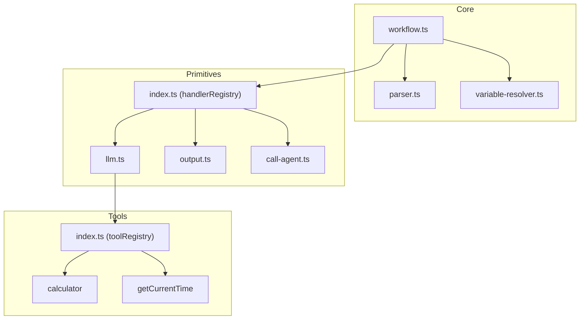

# Components

## Core Components

### Parser (`src/core/parser.ts`)

**Responsibility:** Load and parse YAML workflow definitions securely.

**Key Interfaces:**
- `loadYaml(path: string): Promise<ParsedYaml>`

**Dependencies:** `js-yaml`

**Technology Stack:** Uses `FAILSAFE_SCHEMA` to prevent function instantiation.

---

### WorkflowExecutor (`src/core/workflow.ts`)

**Responsibility:** Execute workflow steps sequentially, managing context and variable storage.

**Key Interfaces:**
- `constructor(yaml: ParsedYaml)`
- `execute(input: any): Promise<Response | Record<string, unknown>>`

**Dependencies:** `handlerRegistry` (primitives)

**Technology Stack:** Pure TypeScript, no external dependencies.

---

### Variable Resolver (`src/core/variable-resolver.ts`)

**Responsibility:** Resolve `$input.*` and `$stepResult.*` variable references.

**Key Interfaces:**
- `resolveVariables(template: any, context: ExecutionContext): any`

**Dependencies:** None

**Technology Stack:** Pure TypeScript.

---

### Primitive Handler Registry (`src/primitives/index.ts`)

**Responsibility:** Register and lookup primitive handlers by step type.

**Key Interfaces:**
- `handlerRegistry: Record<string, PrimitiveHandler>`

**Dependencies:** `llm`, `output-generator`, `call-agent` primitives

**Technology Stack:** Registry pattern implementation.

---

### LLM Primitive (`src/primitives/llm.ts`)

**Responsibility:** Execute LLM calls with dual-mode support (streaming/blocking) and lifecycle hooks.

**Key Interfaces:**
- `llmPrimitive(config: StepConfig, context: ExecutionContext): Promise<Response | object>`

**Dependencies:** `ai`, `@ai-sdk/google`, `toolRegistry`, `callbackRegistry`

**Technology Stack:** Vercel AI SDK `streamText` and `generateText` with `onFinish`/`onError` callbacks.

---

### Tool Registry (`src/tools/index.ts`)

**Responsibility:** Register and provide tool implementations for LLM primitives.

**Key Interfaces:**
- `toolRegistry: Record<string, ToolImplementation>`
- `ToolImplementation: { description, parameters (Zod), execute }`

**Dependencies:** `zod`

**Technology Stack:** Zod schemas for parameter validation.

---

## Component Diagram

