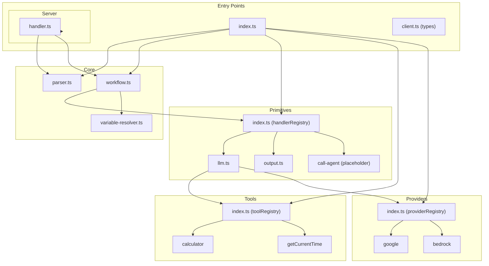

# Components

## Core Components

### Parser (`src/core/parser.ts`)

**Responsibility:** Load and parse YAML workflow definitions securely.

**Key Interfaces:**
- `loadYaml(path: string): Promise<ParsedYaml>`

**Dependencies:** `js-yaml`

**Technology Stack:** Uses `FAILSAFE_SCHEMA` to prevent function instantiation.

---

### WorkflowExecutor (`src/core/workflow.ts`)

**Responsibility:** Execute workflow steps sequentially, managing context and variable storage.

**Key Interfaces:**
- `constructor(yaml: ParsedYaml)`
- `execute(input: any): Promise<Response | Record<string, unknown>>`

**Dependencies:** `handlerRegistry` (primitives)

**Technology Stack:** Pure TypeScript, no external dependencies.

---

### Variable Resolver (`src/core/variable-resolver.ts`)

**Responsibility:** Resolve `$input.*` and `$stepResult.*` variable references.

**Key Interfaces:**
- `resolveVariables(template: any, context: ExecutionContext): any`

**Dependencies:** None

**Technology Stack:** Pure TypeScript.

---

### Primitive Handler Registry (`src/primitives/index.ts`)

**Responsibility:** Register and lookup primitive handlers by step type.

**Key Interfaces:**
- `handlerRegistry: Record<string, PrimitiveHandler>`
- `registerPrimitive(type: string, handler: PrimitiveHandler): void`

**Dependencies:** `llm`, `output-generator`, `call-agent` primitives

**Technology Stack:** Registry pattern implementation.

---

### LLM Primitive (`src/primitives/llm.ts`)

**Responsibility:** Execute LLM calls with dual-mode support (streaming/blocking) and lifecycle hooks.

**Key Interfaces:**
- `llmPrimitive(config: StepConfig, context: ExecutionContext): Promise<Response | object>`
- `mapTools(toolDefinitions): ToolSet` - Maps YAML tool definitions to SDK tools
- `registerCallback(name: string, fn: CallbackFn): void` - Register lifecycle callbacks
- `callbackRegistry: Record<string, CallbackFn>` - Stores registered callbacks

**Dependencies:** `ai`, `providerRegistry`, `toolRegistry`, `callbackRegistry`

**Technology Stack (AI SDK v6):**
- `streamText()` for streaming mode → `result.toUIMessageStreamResponse()`
- `generateText()` for blocking mode → `{ text, usage }`
- `convertToModelMessages()` for UIMessage[] → ModelMessage[] conversion
- `dynamicTool()` for registry-based tool creation
- `stopWhen: stepCountIs(5)` for multi-step tool loops
- `onFinish` / `onError` lifecycle callbacks
- `createModel()` from provider registry for dynamic provider selection

**AI SDK v6 Message Format Compatibility:**
- Frontend (`useChat`) sends `UIMessage[]` with `{ parts: [...] }` format
- Backend (`streamText`/`generateText`) expects `ModelMessage[]` with `{ content: ... }`
- `convertToModelMessages()` bridges this gap automatically
- `toUIMessageStreamResponse()` returns the correct stream format for `useChat`

---

### Provider Registry (`src/providers/index.ts`)

**Responsibility:** Register and provide LLM provider implementations for dynamic model creation.

**Key Interfaces:**
- `providerRegistry: Record<string, ProviderImplementation>`
- `registerProvider(name: string, implementation: ProviderImplementation): void`
- `createModel(provider: string, config: ProviderConfig): LanguageModel`
- `ProviderImplementation: { createModel: (config) => LanguageModel }`
- `ProviderConfig: { model: string, [key: string]: unknown }`

**Built-in Providers:**
- `google` - Google Gemini via `@ai-sdk/google` (requires `GEMINI_API_KEY`)
- `bedrock` - Amazon Bedrock via `@ai-sdk/amazon-bedrock` (requires `AWS_REGION`, defaults to `us-east-1`)

**Environment Variables:**

| Provider | Variable | Description |
|----------|----------|-------------|
| `google` | `GEMINI_API_KEY` | Google Gemini API key |
| `bedrock` | `AWS_REGION` | AWS region (defaults to `us-east-1`) |
| `bedrock` | `AWS_BEARER_TOKEN_BEDROCK` | Bedrock API key (or use standard AWS credentials) |

**Dependencies:** `ai`, `@ai-sdk/google`, `@ai-sdk/amazon-bedrock`

**Technology Stack:** Registry pattern with Vercel AI SDK LanguageModel interface.

---

### Output Primitive (`src/primitives/output.ts`)

**Responsibility:** Deterministic JSON transform using variable resolution.

**Key Interfaces:**
- `outputPrimitive(config: StepConfig, context: ExecutionContext): Promise<Record<string, unknown>>`

**Dependencies:** `resolveVariables`

**Technology Stack:** Pure TypeScript.

---

### Call Agent Primitive (Placeholder)

**Responsibility:** Invoke another YAML workflow as a subroutine.

**Status:** 🚧 Coming Soon — currently registered as placeholder handler.

---

### Tool Registry (`src/tools/index.ts`)

**Responsibility:** Register and provide tool implementations for LLM primitives.

**Key Interfaces:**
- `toolRegistry: Record<string, ToolImplementation>`
- `registerTool(name: string, implementation: ToolImplementation): void`
- `ToolImplementation: { description, parameters (Zod), execute }`

**Built-in Tools:**
- `calculator` - Evaluate mathematical expressions
- `getCurrentTime` - Get current ISO timestamp

**Dependencies:** `zod`

**Technology Stack:** Zod schemas for parameter validation.

---

### Server Handler (`src/server/handler.ts`)

**Responsibility:** Factory for creating Next.js API route handlers.

**Key Interfaces:**
- `createBeddelHandler(options?: BeddelHandlerOptions): (request: NextRequest) => Promise<Response>`
- `BeddelHandlerOptions: { agentsPath?: string }`

**Dependencies:** `loadYaml`, `WorkflowExecutor`, `next/server`

**Technology Stack:** Next.js App Router API Routes.

**Usage:**
```typescript
// app/api/beddel/chat/route.ts
import { createBeddelHandler } from 'beddel/server';

export const POST = createBeddelHandler({
  agentsPath: 'src/agents'  // Default: 'src/agents'
});
```

---

## Extensibility APIs

Beddel follows the **Expansion Pack Pattern** for extensibility:

### `registerPrimitive(type, handler)`

Add custom step types to the workflow engine.

```typescript
import { registerPrimitive } from 'beddel';

registerPrimitive('http-fetch', async (config, context) => {
  const response = await fetch(config.url);
  return { data: await response.json() };
});
```

### `registerTool(name, implementation)`

Add custom tools for LLM function calling.

```typescript
import { registerTool } from 'beddel';
import { z } from 'zod';

registerTool('weatherLookup', {
  description: 'Get weather for a city',
  parameters: z.object({ city: z.string() }),
  execute: async ({ city }) => fetchWeather(city),
});
```

### `registerCallback(name, fn)`

Add lifecycle hooks for streaming completion.

```typescript
import { registerCallback } from 'beddel';

registerCallback('persistConversation', async ({ text, usage }) => {
  await db.saveMessage(text, usage);
});
```

### `registerProvider(name, implementation)`

Add custom LLM providers for dynamic model selection.

```typescript
import { registerProvider } from 'beddel';
import { createOpenAI } from '@ai-sdk/openai';

registerProvider('openai', {
  createModel: (config) => {
    const openai = createOpenAI({ apiKey: process.env.OPENAI_API_KEY });
    return openai(config.model || 'gpt-4');
  },
});
```

---

## Component Diagram



