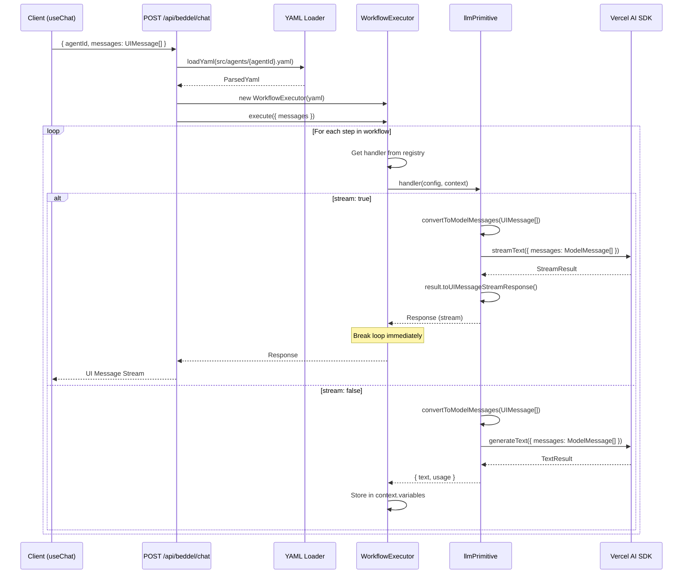
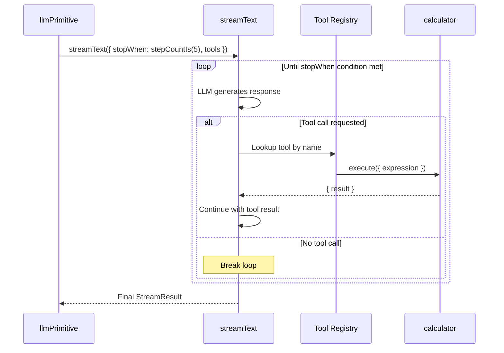
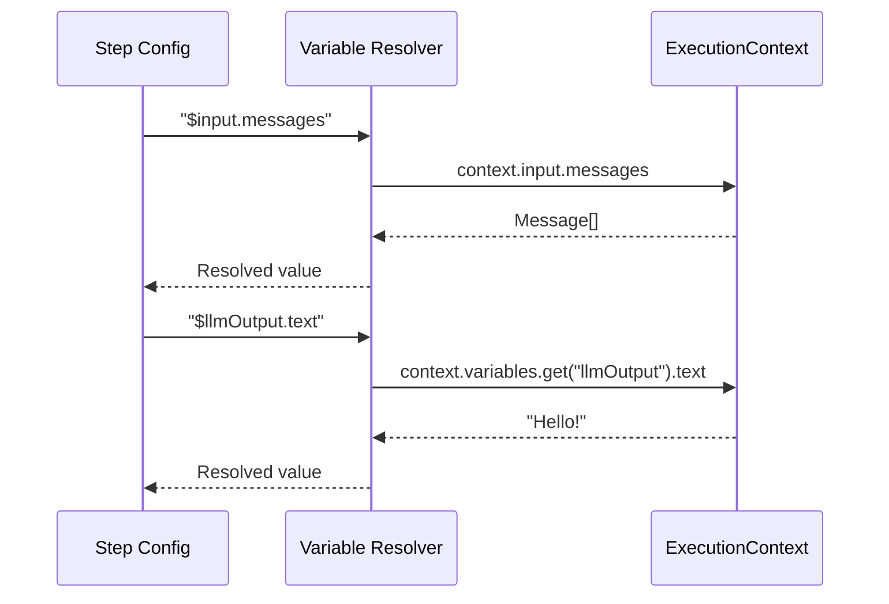
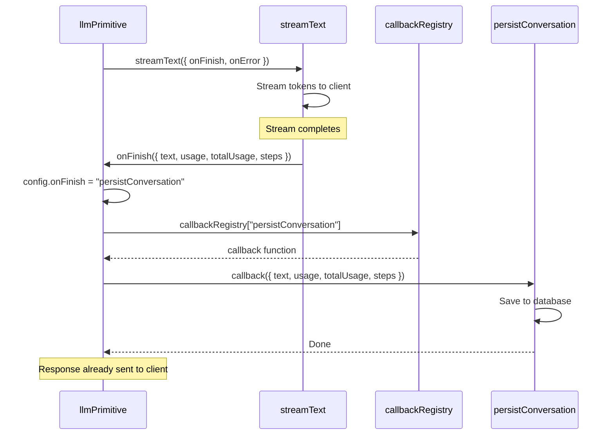

# Core Workflows

## Consumer Setup Flow

Setting up Beddel in a Next.js application:

### 1. Install Package

```bash
npm install beddel
# or
pnpm add beddel
```

### 2. Create API Route

```typescript
// app/api/beddel/chat/route.ts
import { createBeddelHandler } from 'beddel/server';

export const POST = createBeddelHandler({
  agentsPath: 'src/agents'  // Optional, default: 'src/agents'
});
```

### 3. Create YAML Agent

```yaml
# src/agents/assistant.yaml
metadata:
  name: "Streaming Assistant"
  version: "1.0.0"

workflow:
  - id: "chat-interaction"
    type: "llm"
    config:
      provider: "google"          # Optional: 'google' (default) or 'bedrock'
      model: "gemini-2.0-flash-exp"
      stream: true
      system: "You are a helpful and concise assistant."
      messages: "$input.messages"
```

**Using Amazon Bedrock:**

```yaml
# src/agents/bedrock-assistant.yaml
metadata:
  name: "Bedrock Assistant"
  version: "1.0.0"

workflow:
  - id: "chat-interaction"
    type: "llm"
    config:
      provider: "bedrock"
      model: "anthropic.claude-3-haiku-20240307-v1:0"
      stream: true
      system: "You are a helpful assistant."
      messages: "$input.messages"
```

### 4. (Optional) Register Custom Extensions

```typescript
// app/api/beddel/chat/route.ts
import { createBeddelHandler } from 'beddel/server';
import { registerTool, registerCallback, registerProvider } from 'beddel';
import { z } from 'zod';
import { createOpenAI } from '@ai-sdk/openai';

// Register custom LLM provider
registerProvider('openai', {
  createModel: (config) => {
    const openai = createOpenAI({ apiKey: process.env.OPENAI_API_KEY });
    return openai(config.model || 'gpt-4');
  },
});

// Register custom tool
registerTool('myTool', {
  description: 'My custom tool',
  parameters: z.object({ input: z.string() }),
  execute: async ({ input }) => ({ result: input.toUpperCase() }),
});

// Register lifecycle callback
registerCallback('saveConversation', async ({ text, usage }) => {
  await db.saveMessage(text, usage);
});

export const POST = createBeddelHandler();
```

---

## YAML Structure

YAML files define a **Pipeline** of sequential steps:

```yaml
metadata:
  name: "Agent Name"
  version: "1.0.0"

workflow:
  - id: "step-1"
    type: "llm"           # Primitive type
    config:
      provider: "google"  # Optional: 'google' (default) or 'bedrock' or custom
      model: "gemini-2.0-flash-exp"
      stream: true        # true = streaming, false = blocking
      system: "System prompt"
      messages: "$input.messages"
      tools:              # Optional: tools for function calling
        - name: "calculator"
      onFinish: "callbackName"   # Optional: lifecycle hook
    result: "stepOutput"  # Optional: variable name for result

  - id: "step-2"
    type: "output-generator"
    config:
      template:
        status: "completed"
        tokens: "$stepOutput.usage"
```

### Variable Resolution Patterns

| Pattern | Description | Example |
|---------|-------------|---------|
| `$input.*` | Access request input data | `$input.messages` |
| `$stepResult.varName.*` | Access step result by result name | `$stepResult.llmOutput.text` |
| `$varName.*` | Legacy: direct variable access | `$llmOutput.usage` |

---

## Streaming Chat Flow



### AI SDK v6 Message Format

The LLM primitive handles message format conversion automatically:

| Source | Format | Example |
|--------|--------|---------|
| Frontend (`useChat`) | `UIMessage[]` | `{ role: "user", parts: [{ type: "text", text: "Hello" }] }` |
| Backend (`streamText`) | `ModelMessage[]` | `{ role: "user", content: "Hello" }` |

- `convertToModelMessages()` converts `UIMessage[]` → `ModelMessage[]`
- `toUIMessageStreamResponse()` returns the correct stream format for `useChat`

## Tool Loop Flow

When tools are defined, the LLM may invoke them in a multi-step loop:



## Variable Resolution Flow

How variables like `$input.messages` are resolved:



## onFinish Lifecycle Hook Flow

How `onFinish` executes after streaming completes (Option B: direct callbacks):


