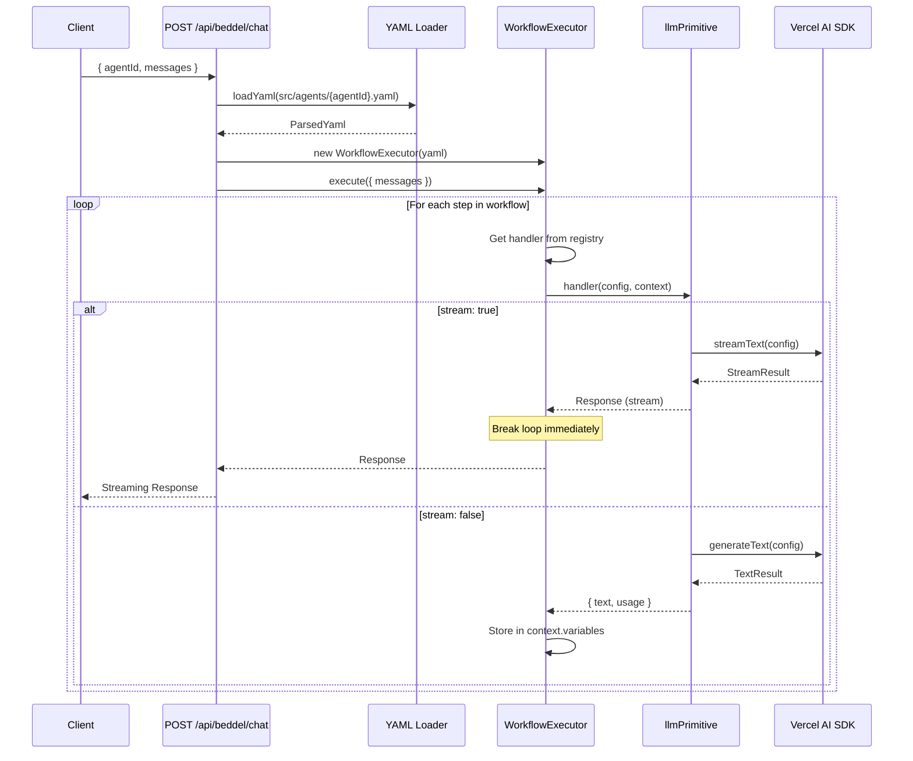
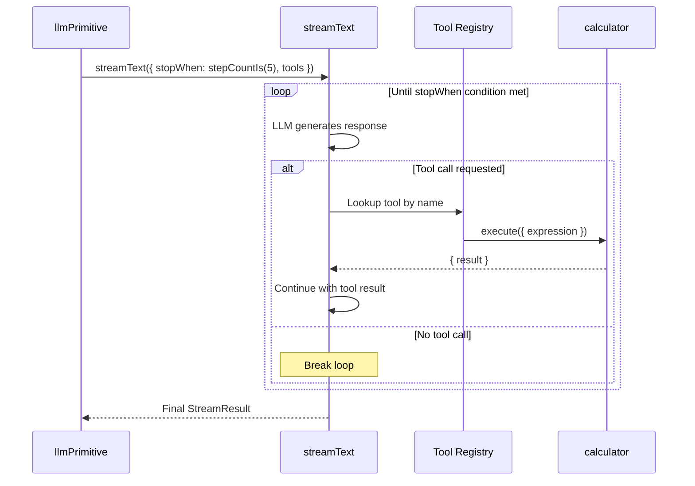
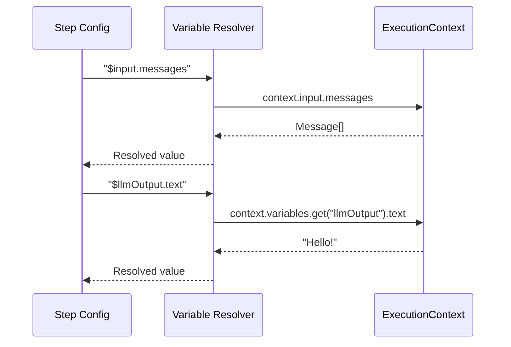
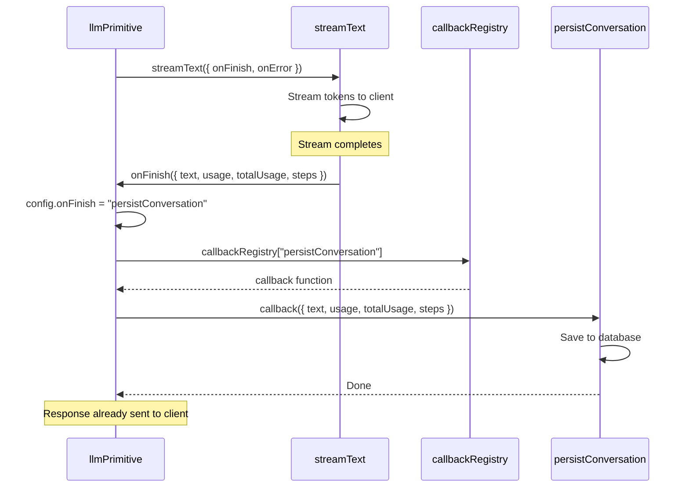

# Core Workflows

## Streaming Chat Flow

The primary workflow for a streaming chat interaction:

## Tool Loop Flow

When tools are defined, the LLM may invoke them in a multi-step loop:

## Variable Resolution Flow

How variables like `$input.messages` are resolved:

## onFinish Lifecycle Hook Flow

How `onFinish` executes after streaming completes (Option B: direct callbacks):

