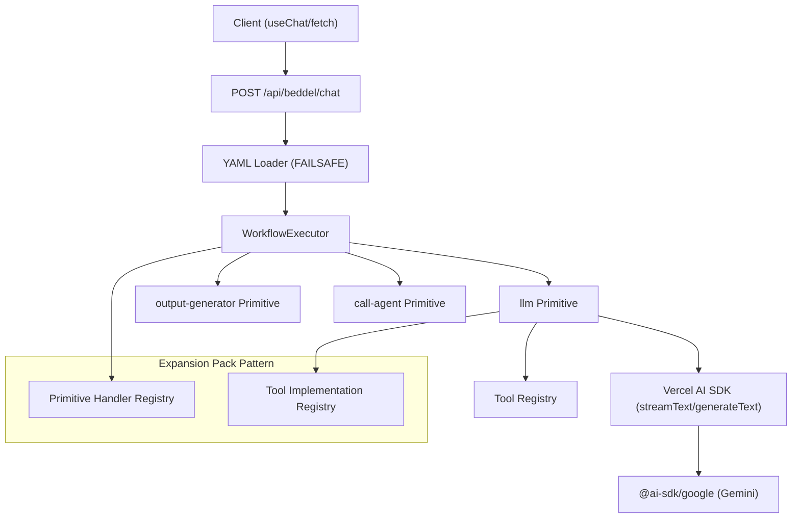

# High Level Architecture

## Technical Summary

Beddel Protocol is a **Sequential Pipeline Executor** that parses YAML workflow definitions and executes steps sequentially. The architecture prioritizes streaming-first LLM responses, secure configuration parsing, and an extensible primitive system. Core patterns include the Expansion Pack Pattern for primitive registration and the early-return pattern for streaming responses.

## High Level Overview

1. **Architectural Style:** Sequential Pipeline (not microservices)
2. **Repository Structure:** Monorepo package (`packages/beddel/`)
3. **Service Architecture:** Stateless executor with no external database dependencies
4. **Primary Data Flow:**
   - Client sends `{ agentId, messages }` to REST endpoint
   - Executor loads YAML, iterates over workflow steps
   - First step returning a `Response` breaks the loop and returns to client
5. **Key Decision:** REST-only API (no GraphQL) for streaming compatibility

## High Level Project Diagram

## Architectural and Design Patterns

- **Sequential Pipeline Pattern:** Workflow steps execute in order; first `Response` return breaks the loop — *Rationale:* Enables streaming without blocking subsequent steps

- **Expansion Pack Pattern:** Primitives and tools are registered in extensible maps (`Record<string, Handler>`) — *Rationale:* Inspired by BMAD-METHOD™, allows community extensions without core changes

- **Early Return Pattern:** When `llmPrimitive` returns `Response`, executor immediately returns to client — *Rationale:* Prevents buffering of streaming responses

- **Registry Pattern:** Both primitives and tools use lookup maps for extensibility — *Rationale:* Decouples YAML definitions from implementation details
